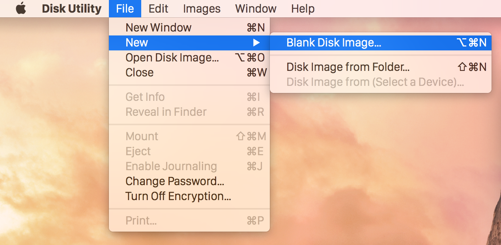
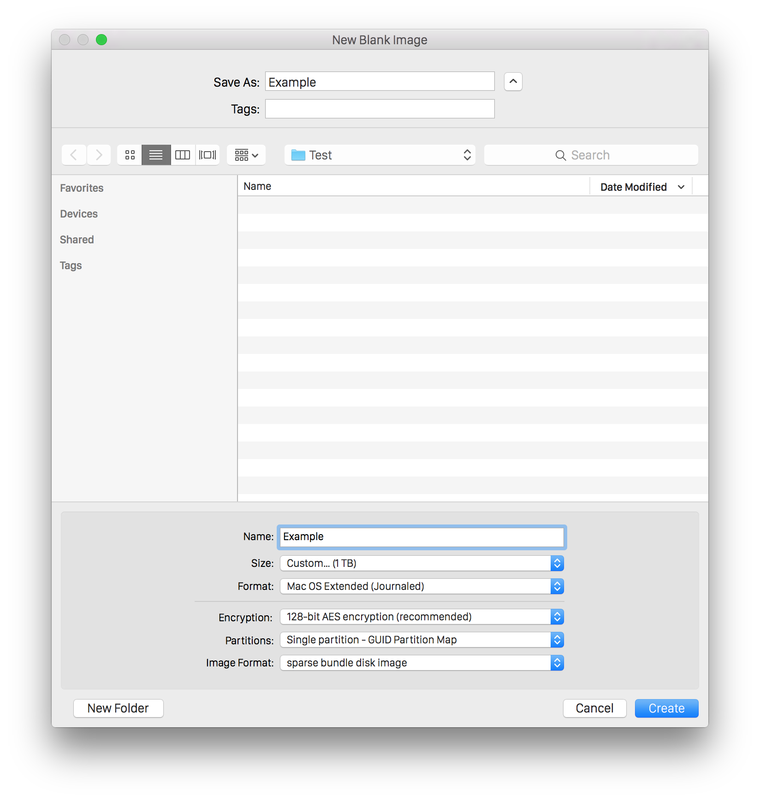

# privacy-hacks
:squirrel: Privacy for Mac users at work or on shared computers.

I occasionally need access to files or messages from my personal Google accounts at work. I got tired of constantly have to sign into Chrome Incognito tabs every time, and I didn't want my personal Chrome profile and account credentials written to disk on a computer that's not mine.

* Work computer is not mine.
* Don't want my personal Chrome profile and account credentials written to disk and accessible by another user.
* Tired of signing into Chrome Incognito tabs all the time.
* Tired of this shit.

Solution:

* Move Chrome profile to encrypted disk image.
* Symlink profile back to `~/Library/Application\ Support/Google/Chrome/Default`
* Create **_Automator Application_** to mount _img_ then _open Chrome_.

>**_Automator Application_** > _Run Shell Script:_
>```
>hdiutil attach /Users/$USER/Dropbox/*.sparsebundle && sleep 2 && open -a Google\ Chrome
>```

_hdiutil_ will try and mount the _sparsebundle_ disk image and prompt you for the decryption password. If successfully mounted, it will open _Chrome_ in 2 seconds.

### **:warning: Remember to UNCHECK _"Remember this password in my keychain"_** 


## Instructions

### Create the disk image

You can create a sparse bundle using Disk Utility in Mac OS X, as shown below.



>Launch Disk Utility and select File->New->Blank Disk Image…


>Select the location to write the image, then choose “sparse bundle disk image” before setting the size. You can add encryption here, too, and the tool will ask for a passphrase when you click “Create”.

### Copy profile and symlink it

If there is a space in the profile folder name you will need to pass an additional back slash with an escape character.
```
export CHROMEPROFILE=Profile'\'\ 5 ; echo $CHROMEPROFILE
```
Will correctly result in "`Profile\ 5`", for the commands below to interpret properly.

```
echo "SETTING ENV VARIABLES"
export IMGNAME=Example ; echo $IMGNAME
export CHROMEPROFILE="Default" ; echo $CHROMEPROFILE
echo "MOUNTING AND UNLOCKING CHROME PRIVATE PROFILE DISK IMAGE"
hdiutil attach ~/Dropbox/$IMGNAME.sparsebundle
echo "CREATING CHROME PROFILE DIRECTORIES"
mkdir /Volumes/$IMGNAME/Library /Volumes/$IMGNAME/Library/Application\ Support /Volumes/$IMGNAME/Library/Application\ Support/Google /Volumes/$IMGNAME/Library/Application\ Support/Google/Chrome /Volumes/$IMGNAME/Library/Application\ Support/Google/Chrome/"$CHROMEPROFILE"
echo "CREATING CHROME PROFILE CACHE DIRECTORIES"
mkdir /Volumes/$IMGNAME/Library /Volumes/$IMGNAME/Library/Caches /Volumes/$IMGNAME/Library/Caches/Google /Volumes/$IMGNAME/Library/Caches/Google/Chrome /Volumes/$IMGNAME/Library/Caches/Google/Chrome/"$CHROMEPROFILE"
echo "COPYING CHROME PROFILE"
cp -R ~/Library/Application\ Support/Google/Chrome/"$CHROMEPROFILE"/ /Volumes/$IMGNAME/Library/Application\ Support/Google/Chrome/"$CHROMEPROFILE"
echo "COPYING CHROME PROFILE CACHE"
cp -R ~/Library/Caches/Google/Chrome/"$CHROMEPROFILE"/ /Volumes/$IMGNAME/Library/Caches/Google/Chrome/"$CHROMEPROFILE"
echo "SYMLINKING CHROME PROFILE"
ln -s /Volumes/$IMGNAME/Library/Application\ Support/Google/Chrome/"$CHROMEPROFILE" ~/Library/Application\ Support/Google/Chrome/"$CHROMEPROFILE"
echo "SYMLINKING CHROME PROFILE CACHE"
ln -s /Volumes/$IMGNAME/Library/Caches/Google/Chrome/"$CHROMEPROFILE" ~/Library/Caches/Google/Chrome/"$CHROMEPROFILE"
```

