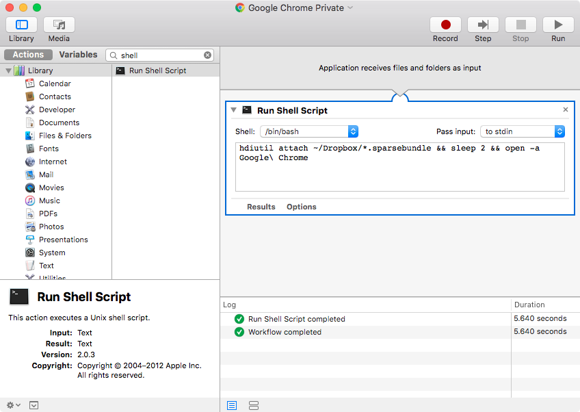

# Portable Google Chrome Profile Privacy Hacks
### :squirrel: Privacy for Mac users at work or on shared computers.

I occasionally need access to files or messages from my personal Google accounts at work. I got tired of constantly have to sign into Chrome Incognito tabs every time, and I didn't want my personal Chrome profile and account credentials written to disk on a computer that's not mine.

* Work computer is not mine.
* Don't want my personal Chrome profile and account credentials written to disk and accessible by another user.
* Tired of signing into Chrome Incognito tabs all the time.
* Tired of this shit.

### Solution:

* Move Chrome profile to encrypted disk image.
* Symlink profile back to `~/Library/Application\ Support/Google/Chrome/Default`
* Create **_Automator Application_** to mount _img_ then _open Chrome_.

>**_Automator Application_** > _Run Shell Script:_
>```
>hdiutil attach ~/Dropbox/*.sparsebundle && sleep 2 && open -a Google\ Chrome
>```

_hdiutil_ will try and mount the _sparsebundle_ disk image and prompt you for the decryption password. If successfully mounted, it will open _Chrome_ in 2 seconds.

### **:warning: Remember to UNCHECK _"Remember this password in my keychain"_** 

**:fire: Bonus:**

* Put it in a Dropbox folder so you can remote wipe it.
* Use a dedicated _free_ account to limit data leakage.


## Instructions

### Create the disk image

You can create a sparse bundle using Disk Utility in Mac OS X, as shown below.


>Launch Disk Utility and select File->New->Blank Disk Image…


>Select the location to write the image, then choose “sparse bundle disk image” before setting the size. You can add encryption here, too, and the tool will ask for a passphrase when you click “Create”.

### Copy profile and symlink it

Replace the environment variables at the top. 

Eg. `CHROMEPROFILE="Default"` Replace `Default` with your Chrome profile; _`CHROMEPROFILE="Profile 5"`_.

Also add the name of the disk image.

Eg. `IMGNAME="Example"` replace `Example` with `defeatsweat` or w/e your diskimage is called...

```
echo "SETTING ENV VARIABLES"
export IMGNAME="Example" ; echo $IMGNAME
export CHROMEPROFILE="Default" ; echo $CHROMEPROFILE
echo "MOUNTING AND UNLOCKING CHROME PRIVATE PROFILE DISK IMAGE"
hdiutil attach ~/Dropbox/"$IMGNAME".sparsebundle
echo "CREATING CHROME PROFILE DIRECTORIES"
mkdir /Volumes/"$IMGNAME"/Library /Volumes/"$IMGNAME"/Library/Application\ Support /Volumes/"$IMGNAME"/Library/Application\ Support/Google /Volumes/"$IMGNAME"/Library/Application\ Support/Google/Chrome /Volumes/"$IMGNAME"/Library/Application\ Support/Google/Chrome/"$CHROMEPROFILE"
echo "CREATING CHROME PROFILE CACHE DIRECTORIES"
mkdir /Volumes/"$IMGNAME"/Library /Volumes/"$IMGNAME"/Library/Caches /Volumes/"$IMGNAME"/Library/Caches/Google /Volumes/"$IMGNAME"/Library/Caches/Google/Chrome /Volumes/"$IMGNAME"/Library/Caches/Google/Chrome/"$CHROMEPROFILE"
echo "COPYING CHROME PROFILE"
cp -R ~/Library/Application\ Support/Google/Chrome/"$CHROMEPROFILE"/ /Volumes/"$IMGNAME"/Library/Application\ Support/Google/Chrome/"$CHROMEPROFILE"
echo "COPYING CHROME PROFILE CACHE"
cp -R ~/Library/Caches/Google/Chrome/"$CHROMEPROFILE"/ /Volumes/"$IMGNAME"/Library/Caches/Google/Chrome/"$CHROMEPROFILE"
echo "SYMLINKING CHROME PROFILE"
ln -s /Volumes/"$IMGNAME"/Library/Application\ Support/Google/Chrome/"$CHROMEPROFILE" ~/Library/Application\ Support/Google/Chrome/"$CHROMEPROFILE"
echo "SYMLINKING CHROME PROFILE CACHE"
ln -s /Volumes/"$IMGNAME"/Library/Caches/Google/Chrome/"$CHROMEPROFILE" ~/Library/Caches/Google/Chrome/"$CHROMEPROFILE"
```

### Automator application launcher

Now you need a special button to prompt for the decryption password and then launch Google Chrome.

[<br />:floppy_disk: Download Chrome Automator application](https://github.com/reelsense/privacy-hacks/raw/master/Google%20Chrome%20Private.zip)<br />

<sub>:lock_with_ink_pen: [Minisign Signature](https://raw.githubusercontent.com/reelsense/privacy-hacks/master/Google%20Chrome%20Private.zip.minisig) - [GPG Signature](https://raw.githubusercontent.com/reelsense/privacy-hacks/master/Google%20Chrome%20Private.zip.sig)</sub>

```
sha256 = 0c71b46d2696656135f8f7f8979fd55e0309c52baf7d274ad5b1e651cf09c4b2
sha512 = ae9dd73c7e7df57611ed7c6e49ef3a632f9532d7e938e29af1c681a840b760ea35788ac21ae7d53016af7c5a920953f4870f803e18c10aad4693a366f73a9f9d
```
###### [What is the functional difference between a checksum and a signature?](http://mostvulnerable.com/#toc3)



>```
>hdiutil attach ~/Dropbox/*.sparsebundle && sleep 2 && open -a Google\ Chrome
>```


### [Return to my collection of browser tools and scripts](https://github.com/reelsense/browser-scripts-tools)
